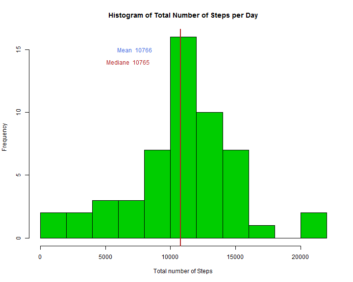
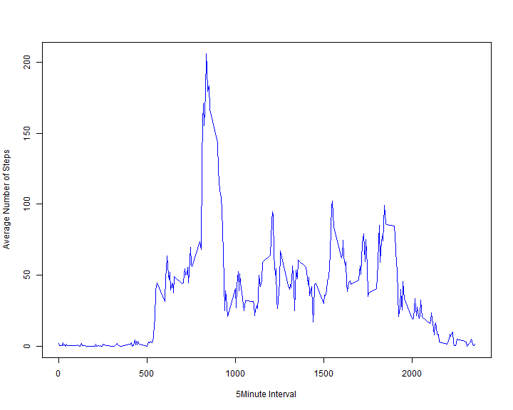
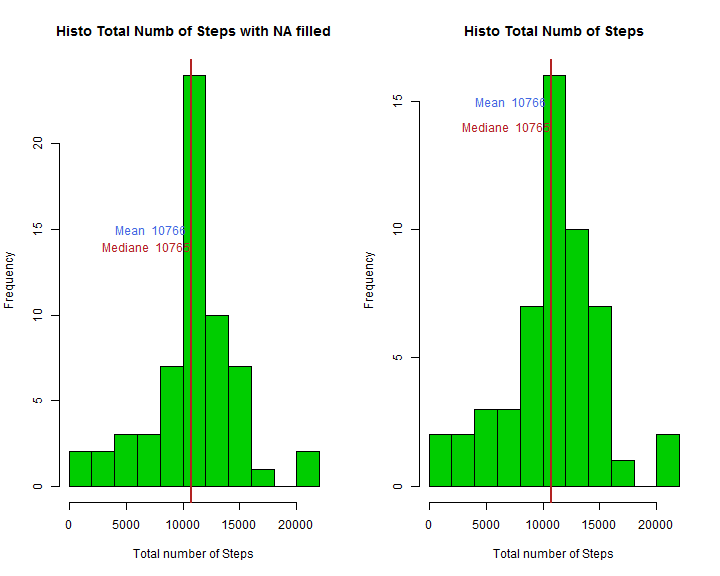
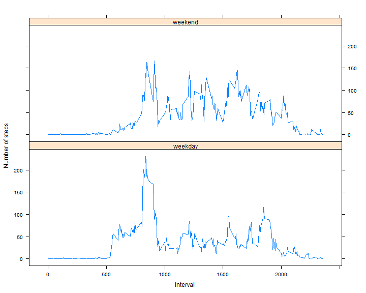

```r
# Reproducible Research: Peer Assessment 1

## Loading and preprocessing the data
activity <- read.csv("E:/Data/activity.csv")
attach(activity)
require(data.table)
```

```
## Loading required package: data.table
```

```r
library(data.table)
require("lattice")
```

```
## Loading required package: lattice
```

```r
library(lattice)
activityT <- data.table(activity)
```


```r
## What is mean total number of steps taken per day?
StepsDay <- activityT[, list(stepsD = sum(steps)), by = date]
colors <- c("green3", "royalblue", "firebrick")
### hitogram of total number of Steps
hist(StepsDay$stepsD, col = colors[1], nclass = 15, main = "Histogram of Total Number of Steps per Day", 
    xlab = "Total number of Steps")
### calculate ane report Mean and Mediane
Smean <- as.integer(mean(StepsDay$stepsD, na.rm = "TRUE"))
Smed <- as.integer(median(StepsDay$stepsD, na.rm = "TRUE"))
abline(v = Smean, col = colors[2], lwd = 2)
abline(v = Smed, col = colors[3], lwd = 2)
text((Smean - 3500), 15, paste("Mean ", Smean), col = colors[2])
text((Smed - 4000), 14, paste("Mediane ", Smed), col = colors[3])
```

 


```r
## What is the average daily activity pattern?
StepsInterv <- activityT[, list(stepsI = mean(steps, na.rm = TRUE)), by = interval]
### time series plot
plot(stepsI ~ interval, StepsInterv, type = "l", ylab = "Average Number of Steps", 
    xlab = "5Minute Interval", col = "Blue")
```

 

```r
### interval with maximum number of steps
subset(StepsInterv, stepsI == max(StepsInterv$stepsI))
```

```
##    interval stepsI
## 1:      835  206.2
```

```r
maxstep <- subset(StepsInterv, stepsI == max(StepsInterv$stepsI))
paste("maximum number of steps per interval is ", as.integer(maxstep$stepsI))
```

```
## [1] "maximum number of steps per interval is  206"
```


```r
## Imputing missing values total number of missing values
activityrmNA <- activity
vect <- which(is.na(activityrmNA[, "steps"]))
paste("Total number of missing value is ", length(vect))
```

```
## [1] "Total number of missing value is  2304"
```

```r
### filling in all of the missing values in the dataset our strategy is based
### on remplacement of NA value by the mean of corresponding interval
j = length(vect)
for (i in 1:j) {
    activityrmNA$steps[vect[i]] = StepsInterv$stepsI[StepsInterv$interval == 
        activityrmNA$interval[vect[i]]]
}
### Create a new dataset with missing value filled in
activityrmNAT <- data.table(activityrmNA)
StepsDayN <- activityrmNAT[, list(stepsD = sum(steps)), by = date]

### Make a histogram of the total number of steps with Mean and Mediane
par(mfrow = c(1, 2))
hist(StepsDayN$stepsD, col = colors[1], nclass = 15, main = "Histo Total Numb of Steps with NA filled", 
    xlab = "Total number of Steps")
SmeanN <- as.integer(mean(StepsDayN$stepsD, na.rm = "TRUE"))
SmedN <- as.integer(median(StepsDayN$stepsD, na.rm = "TRUE"))
abline(v = SmeanN, col = colors[2], lwd = 2)
abline(v = SmedN, col = colors[3], lwd = 2)
text((SmeanN - 3500), 15, paste("Mean ", Smean), col = colors[2])
text((SmedN - 4000), 14, paste("Mediane ", Smed), col = colors[3])
#### we add the histogram of initial data set for comparaison
hist(StepsDay$stepsD, col = colors[1], nclass = 15, main = "Histo Total Numb of Steps", 
    xlab = "Total number of Steps")
Smean <- as.integer(mean(StepsDay$stepsD, na.rm = "TRUE"))
Smed <- as.integer(median(StepsDay$stepsD, na.rm = "TRUE"))
abline(v = Smean, col = colors[2], lwd = 2)
abline(v = Smed, col = colors[3], lwd = 2)
text((Smean - 3500), 15, paste("Mean ", Smean), col = colors[2])
text((Smed - 4000), 14, paste("Mediane ", Smed), col = colors[3])
```

 


```r
## Are there differences in activity patterns between weekdays and weekends?
## new factor variable in dataset with weekday/weekend levels
activityrmNAT$day <- weekdays(as.Date(activityrmNAT$date))

for (i in 1:nrow(activityrmNAT)) {
    if ((activityrmNAT$day[i] == "Saturday") | (activityrmNAT$day[i] == "Sunday")) {
        activityrmNAT$dayF[i] <- "weekend"
    } else {
        activityrmNAT$dayF[i] <- "weekday"
    }
}

### panel plot containing a time series plot
StepsDayW <- activityrmNAT[, list(stepsW = mean(steps)), by = list(interval, 
    dayF)]
xyplot(stepsW ~ interval | dayF, data = StepsDayW, type = "l", layout = c(1, 
    2), xlab = "Interval", ylab = "Number of steps")
```

 

